# Random Generator Application Demonstrating usage of Eclipse JKube for deploying onto Kubernetes


[](https://twitter.com/jkubeio)

> Note: This a demo project for [Eclipse JKube](https://github.com/eclipse/jkube) for a blog. You can find full blog here: [Introduction to Eclipse JKube: Java tooling for Kubernetes/OpenShift](https://developers.redhat.com/blog/2020/01/28/introduction-to-eclipse-jkube-java-tooling-for-kubernetes-and-red-hat-openshift/)

<p align="center">
  <a href="https://www.eclipse.org/jkube/">
  	
  </a>
</p>

> Note: This is a maven project demo-ing Eclipse JKube Kubernetes Maven Plugin. Gradle Users are advised to visit this repository: https://github.com/rohankanojia-forks/eclipse-jkube-demo-project-gradle

This is a simple random number generation application which just generates a random string on `/random` endpoint. It just
demonstrates usage of Eclipse JKube: https://github.com/eclipse/jkube

## Table of Contents:
* [How to Build](#How-to-build)
* [How to Run](#How-to-run)
* [Deploying on Kubernetes](#deploying-on-kubernetes)
* [Deploying on Red Hat OpenShift](#deploying-on-red-hat-openshift)
* [Migrating from Fabric8 Maven Plugin](#migrating-from-fabric8-maven-plugin)

## How to build
Just run `mvn clean install`

## How to run
Do `mvn spring-boot:run`

After spring boot initializes, just do a `curl localhost:8080/random` to check endpoint.

## Deploying on Kubernetes

### Building Docker image

  In order to build docker image of your application, you just have to make sure your docker deamon is running. If using
  minikube, you can simply do `eval $(minikube docker-env)` to expose docker deamon running inside minikube vm. Now in
  order to build simply issue:

  > mvn k8s:build

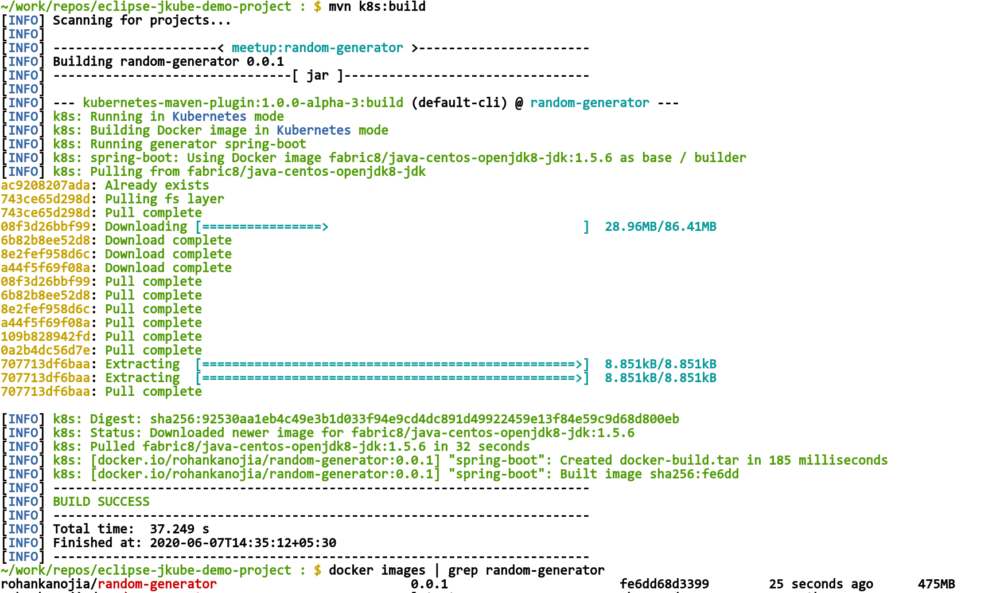

### Pushing your created Docker Image to some container registry

  Make sure you have your image name configured with respect to the registry you want to push to. In this case I would be pushing
  it to Docker Hub. I have added this property which overrides name of the Image being used:
  ```
  <properties>
      <jkube.generator.name>docker.io/rohankanojia/random-generator:${project.version}</jkube.generator.name>
  </properties>

  ```
  I have my registry setting being defined in my `~/.m2/settings.xml` like this:
 ```
<?xml version="1.0" encoding="UTF-8"?>
<settings xmlns="http://maven.apache.org/SETTINGS/1.0.0"
          xmlns:xsi="http://www.w3.org/2001/XMLSchema-instance"
          xsi:schemaLocation="http://maven.apache.org/SETTINGS/1.0.0 http://maven.apache.org/xsd/settings-1.0.0.xsd">
  <servers>
    <server>
      <id>docker.io</id>
      <username>rohankanojia</username>
      <password>password</password>
    </server>
  </servers>
</settings>

  ```
  > mvn k8s:push


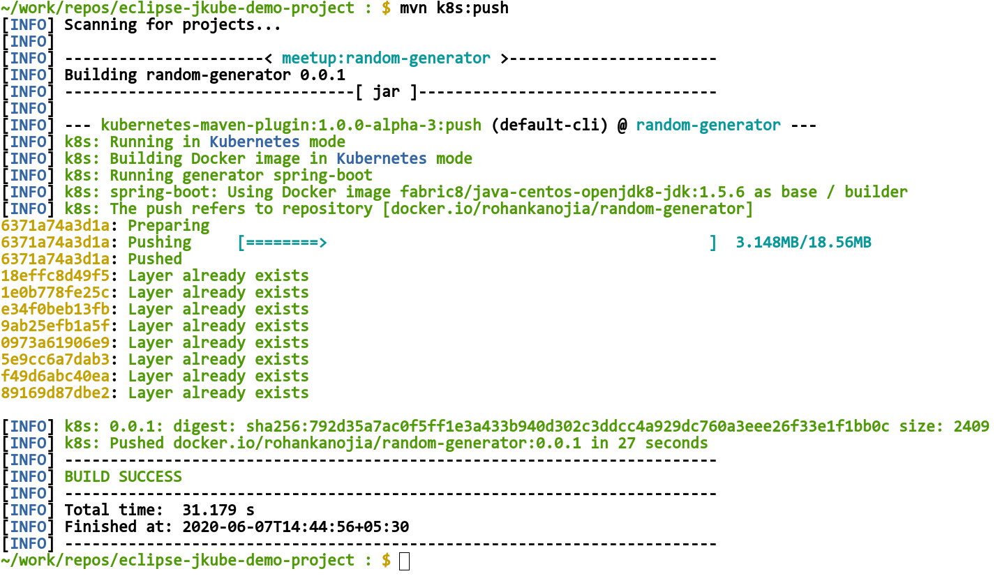
   Once pushed you can see your image being pushed to Docker registry like this:

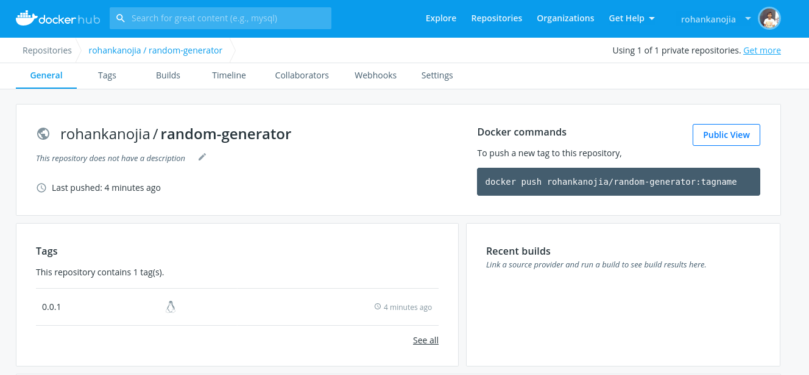

### Generating Kubernetes Manifests
  
  Once your image is built, you need to generate Kubernetes resource manifests for your Deployments, Service etc. To do
  it using Eclipse Jkube Kubernetes Maven Plugin just do:

> mvn k8s:resource

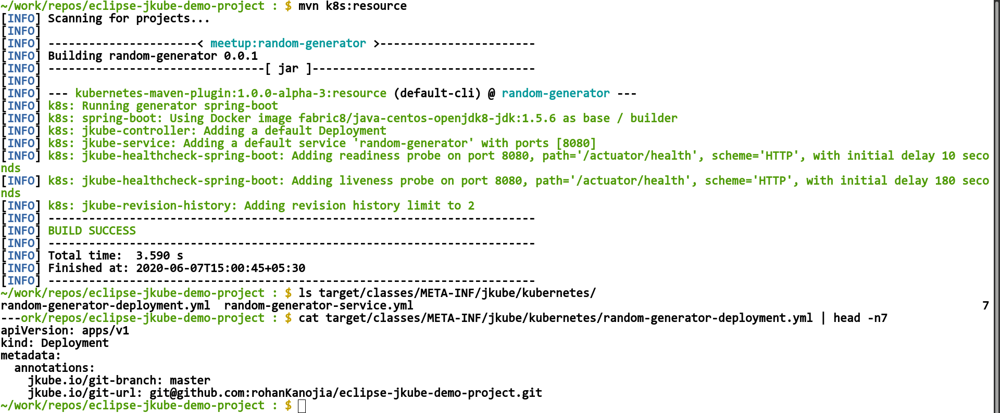

### Deploying application onto Kubernetes
  
  In order to deploy these generated manifests onto Kubernetes, just issue:

> mvn k8s:apply or mvn k8s:deploy

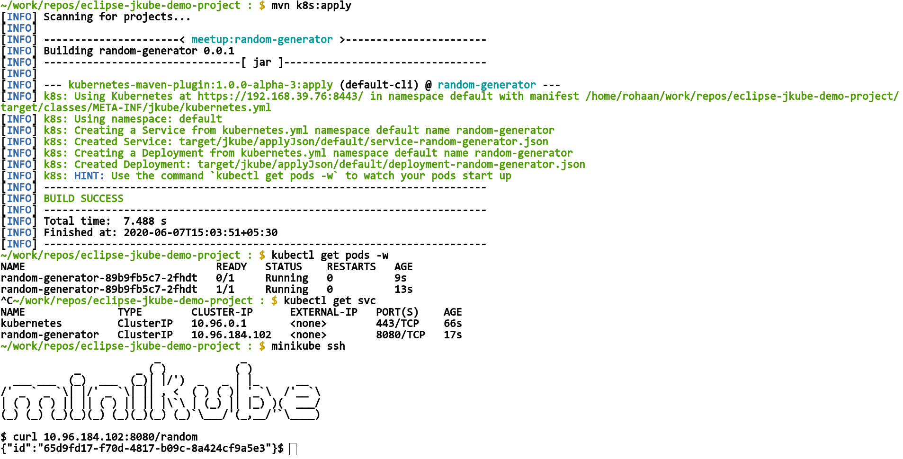
  
  You'd observe they would be applied onto your Kubernetes Cluster. Right now Eclipse JKube has created a `Deployment` and a `Service` based on opinionated defaults. By default `Service` created is of type `ClusterIP`, which means it's only accessible from within the Kubernetes Cluster. That's why you see there is an ssh into minikube for accessing endpoint. If you want to access your application from outside the cluster you have to tell plugin to create service of type `NodePort` by specifying this property:
```
<properties>
    <jkube.enricher.jkube-service.type>NodePort</jkube.enricher.jkube-service.type>
</properties>
```
After that you can notice that `mvn k8s:resource` goal would generate `Service` of type `NodePort`. Here is how it would look like in action:

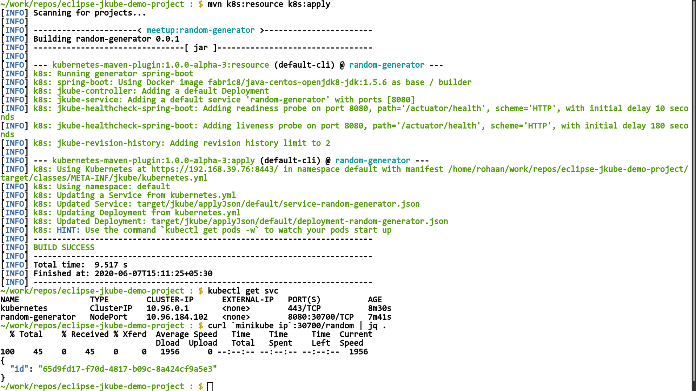


### CleanUp: Un-deploy your application from Kubernetes cluster

  If you want to un-deploy, we have this goal to delete all resources applied.

 > mvn k8s:undeploy

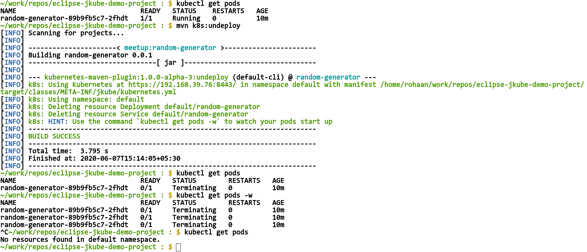

## Deploying on Red Hat OpenShift
[Red Hat OpenShift](https://www.openshift.com/) is Red Hat's official distribution of Kubernetes which empowers developers to innovate and ship faster with the leading hybrid cloud, enterprise container platform.

We would also be taking a look into how [Eclipse JKube OpenShift Maven Plugin](https://github.com/eclipse/jkube/tree/master/openshift-maven-plugin) can be used to deploy this random generator application on top of Red Hat OpenShift.

You can add it as a dependency in your project's `pom.xml` like this:
```
<plugin>
    <groupId>org.eclipse.jkube</groupId>
    <artifactId>openshift-maven-plugin</artifactId>
    <version>${jkube.version}</version>
</plugin>
```

It's already added inside this project's `pom.xml`. So let's start by logging into our OpenShift cluster:
```
~/work/repos/eclipse-jkube-demo-project : $ oc login https://api.rh-idev.openshift.com --token=mytoken
Logged into "https://api.rh-idev.openshift.com:443" as "rohanKanojia" using the token provided.

You have one project on this server: "rokumar"

Using project "rokumar".
```

### Doing an S2I based build 
OpenShift has a really nice [Source-to-image(S2I)](https://docs.openshift.com/container-platform/3.9/creating_images/s2i.html#creating-images-s2i) framework which eases writing images by just providing application source code as an input. Note that you would need to comment out `jkube.generator.name` property that we added during docker build in order to use this. OpenShift Maven Plugin relies on this for build process. Here is how it would look:
> mvn oc:build

>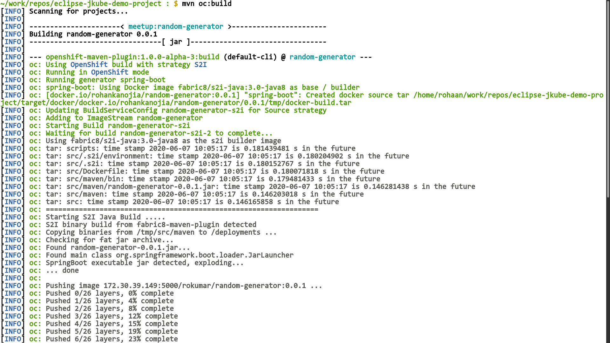

Once build is complete you can see `BuildConfig` being created, OpenShift build process takes care of building and pushing the image to OpenShift's internal container registry:
```
[INFO] oc: Pushed 25/26 layers, 98% complete
[INFO] oc: Pushed 26/26 layers, 100% complete
[INFO] oc: Push successful
[INFO] oc: Build random-generator-s2i-2 in status Complete
[INFO] oc: Found tag on ImageStream random-generator tag: sha256:ebdc41d8cc09a91f2d05106885af137a64babceb35ed5add5d9a1c98e54bb244
[INFO] oc: ImageStream random-generator written to /home/rohaan/work/repos/eclipse-jkube-demo-project/target/random-generator-is.yml
[INFO] ------------------------------------------------------------------------
[INFO] BUILD SUCCESS
[INFO] ------------------------------------------------------------------------
[INFO] Total time:  02:51 min
[INFO] Finished at: 2020-06-07T15:35:26+05:30
[INFO] ------------------------------------------------------------------------
~/work/repos/eclipse-jkube-demo-project : $ oc get pods
NAME                           READY     STATUS      RESTARTS   AGE
random-generator-2-jqsbf       1/1       Running     0          30s
~/work/repos/eclipse-jkube-demo-project : $ oc get bc
NAME                   TYPE      FROM      LATEST
random-generator-s2i   Source    Binary    2
~/work/repos/eclipse-jkube-demo-project : $ oc get build
NAME                     TYPE      FROM      STATUS                   STARTED         DURATION
random-generator-s2i-2   Source    Binary    Complete                 5 minutes ago   2m33s
~/work/repos/eclipse-jkube-demo-project : $ 
```

### Generating Red hat OpenShift manifests
Generating OpenShift manifests is not very different from generating Kubernetes manifests. Only `DeploymentConfig` is used in place of `Deployment`. Here is demonstration of `oc:resource` goal:

> mvn oc:resource

>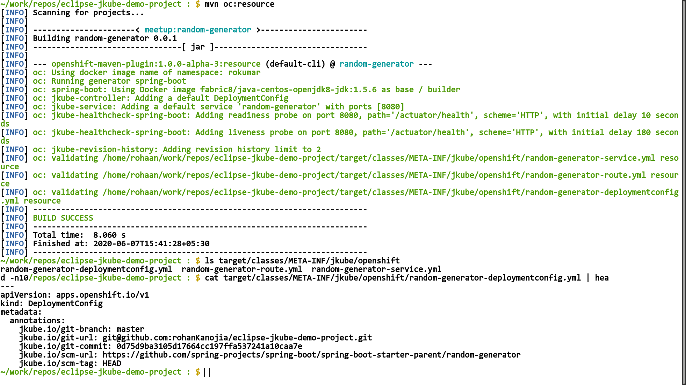

### Applying Generated manifests onto Red Hat OpenShift cluster

> mvn oc:apply or mvn oc:deploy

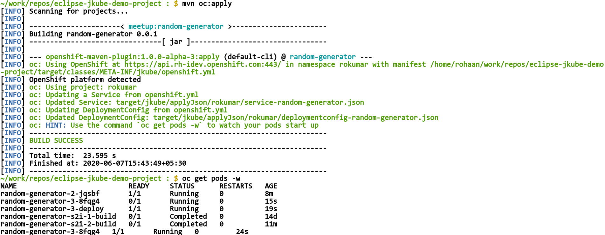

Once deployed you can see your application inside OpenShift console:

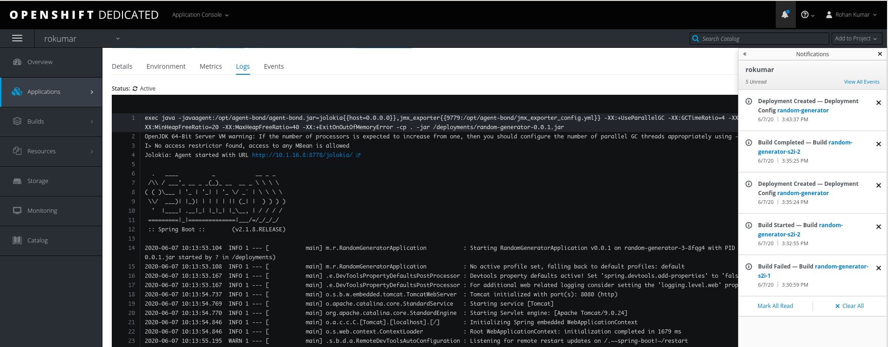

You can then try to access your application via the created `Route`:
```
~/work/repos/eclipse-jkube-demo-project : $ oc get pods
NAME                           READY     STATUS      RESTARTS   AGE
random-generator-3-8fqg4       1/1       Running     0          6m
random-generator-s2i-2-build   0/1       Completed   0          17m
~/work/repos/eclipse-jkube-demo-project : $ oc get routes
NAME               HOST/PORT                                                 PATH      SERVICES           PORT      TERMINATION   WILDCARD
random-generator   random-generator-rokumar.b6ff.rh-idev.openshiftapps.com             random-generator   8080                    None
~/work/repos/eclipse-jkube-demo-project : $ curl random-generator-rokumar.b6ff.rh-idev.openshiftapps.com/random | jq .
  % Total    % Received % Xferd  Average Speed   Time    Time     Time  Current
                                 Dload  Upload   Total   Spent    Left  Speed
100    45    0    45    0     0     51      0 --:--:-- --:--:-- --:--:--    51
{
  "id": "5ab978c0-03c1-4532-9010-3422e58bc569"
}
~/work/repos/eclipse-jkube-demo-project : $ 
```

## Migrating from Fabric8 Maven Plugin

If you're using Fabric8 Maven Plugin to handle your Kubernetes/OpenShift operations, you can easily migrate to Eclipse JKube usingthe migrate goal:

```
mvn org.eclipse.jkube:kubernetes-maven-plugin:migrate
```

Please have a look at Eclipse JKube's [migration guide](https://www.eclipse.org/jkube/docs/migration-guide/) for more details.
